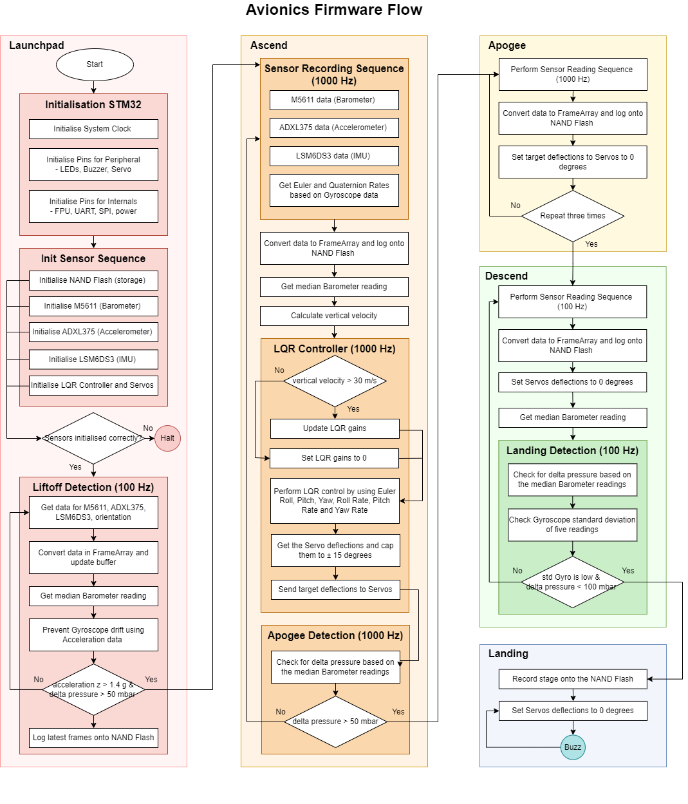
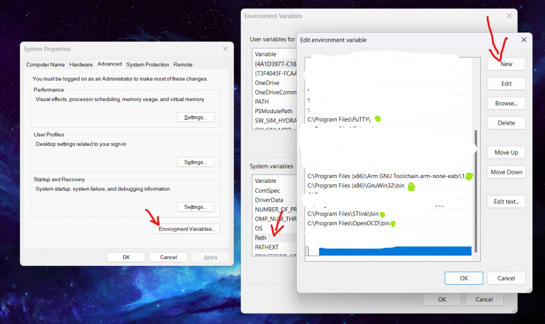
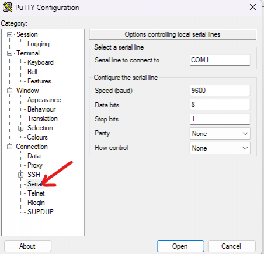
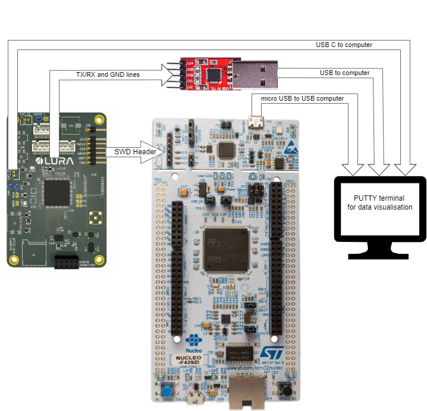

## Aptos Firmware - Flash on the Aptos Module

Firmware is specialised software that is embedded in the non-volatile memory of a hardware device. The hardware platform used is a STM32L4R5ZI-P microcontroller (MCU). The code configures the STM32 MCU and initialises the communications with onboard sensors using SPI (Serial Peripheral Interface) and UART. This includes the initialisation of drivers for the barometer sensor (MS5611), accelerometer (ADXL375), IMU sensor (LSM6DS3), and the NAND Flash memory. 

### Setup
In order to work with the STM32 chips, you need the following tools: Make, ST-LINK and PuTTy.

Steps (Windows):
- Install GnuWin32 to get make in Windows. Include “C:\Program Files (x86)\GnuWin32\bin” to the Environment variable as a new PATH in the Systems variables. Make sure that is your installation path for the make utility.

- Download STLINK. Include bin path to PATH in the Systems variables. 
- Install PuTTY
  - Go to Start/Device Manager/Ports (COM & LPT) and check which port is the board connected to
  - Open PuTTY and select the connection type as Serial
  - Go to the advanced settings and make sure you have the correct configuration

### Flashing
The hardware setup involves powering the board either through a 7.4V battery or a USB (Universal serial bus) connection. A Nucleo-144 board, which incorporates an ST-LINK/V2 in-circuit debugger/programmer, is employed to upload the compiled scripts into flash memory (flashing). The connection between the flight computer and the Nucleo board is established via a 4-pin SWD (Serial Wire Debug) header. Since the ST-Link interface does not support output display from the MCU, an additional serial connection is needed. The UART1 pins are exposed on the Printed Circuit Board (PCB) and connected to a serial interface linked to the computer via USB. Data output is monitored through a PuTTY terminal session which facilitates the debugging of the programmed firmware.

### Debug

Debugging and testing are mandatory for any LURA software because we want to ensure that software programs run as they should. After writing a complete section or part of a code, you need to identify bugs and errors. In order to debug an STM32 chip, you need to install OpenOCD, ARM GNU toolchain (Windows only), GDB (installed separately for Linux, used inside ARM GNU toolchain for Windows). We assume that you have Visual Studio Code installed, if not, please install it.

Steps (Windows):
- Install OpenOCD (get the xpack win32-x64, which includes version 0.12) (here). Include “C:\Program Files\OpenOCD\bin” to the Environment variable as a new PATH in the Systems variables. Make sure that is your installation path for openocd.exe.
- Install ARM GNU toolchain version 12.2. Include “C:\Program Files (x86)\Arm GNU Toolchain arm-none-eabi\12.2 rel1\bin” to the Environment variable as a new PATH in the Systems variables. Make sure that is your installation path.
- Install the VS Code extension “Native Debug”
- Connect the Nucleo STM32L4R5 board to your PC and flash your code
- Run “make debug”. LED4, on the Nucleo board should start flashing in red/green meaning that it is open for communications
- Go to the debug tab in VS Code and press “Debug”
